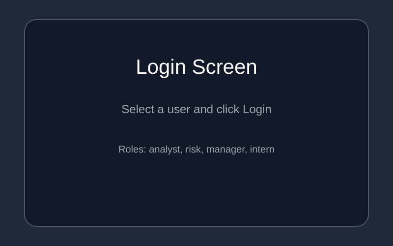
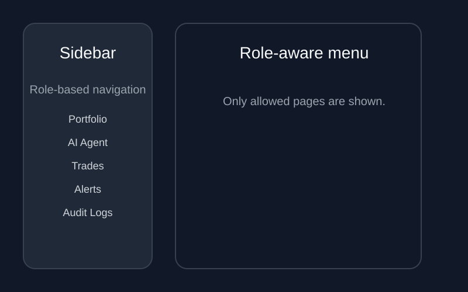
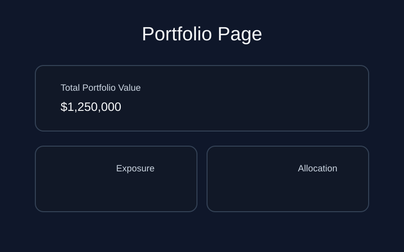
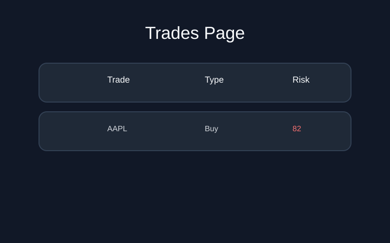
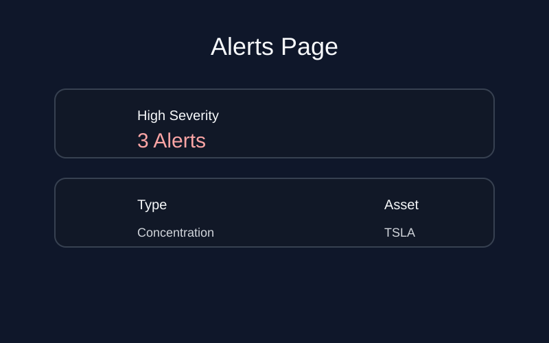
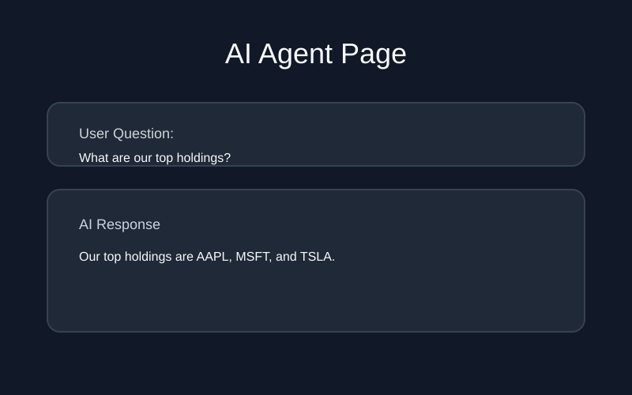
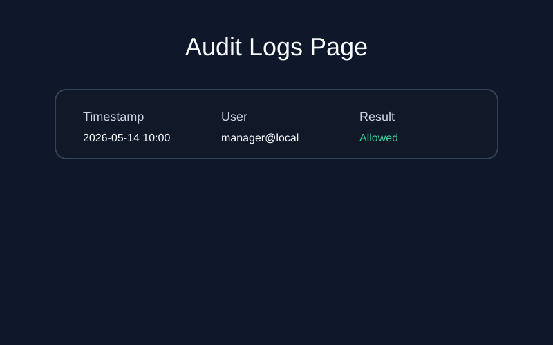

# ARP Assessment Platform Usage Guide

This document provides step-by-step setup, login, and role-based navigation instructions for the ARP Assessment Platform.

> Note: The screenshot references below are placeholders. Replace them with actual images if you capture them from the app.

---

## 1. Setup and Run Locally

### Prerequisites

- Python 3.9 or later
- `pip`
- (Optional) Docker and Docker Compose

### Start the app locally

1. Open a terminal in the repository root:
   ```powershell
   cd c:\Users\NAVEEN KULKARNI\arp_assessment\arp_assessment
   ```
2. Create and activate a Python virtual environment:
   ```powershell
   python -m venv .venv
   .\.venv\Scripts\Activate.ps1
   ```
3. Install Python dependencies:
   ```powershell
   pip install -r requirements.txt
   ```
4. Run the local startup script:
   ```powershell
   run_local.bat
   ```

5. Open the app in your browser:
   - Dashboard: `http://localhost:8501`
   - API health: `http://localhost:8000/api/health`

### Docker option

If you prefer Docker, run these commands:

```powershell
copy .env.example .env
docker compose up -d
```

Then seed mock data if needed:

```powershell
docker compose exec backend python manage.py seed
```

---

## 2. Login and User Selection

The dashboard displays a login panel on first load.

### Users available

| User | Role | Description |
|------|------|-------------|
| `analyst@local` | Analyst | Portfolio and market summary access |
| `risk@local` | Risk | Full portfolio, trades, and risk view |
| `manager@local` | Manager | Portfolio summary and audit logs |
| `intern@local` | Intern | Limited summary access only |

### Login steps

1. Open `http://localhost:8501` in your browser.
2. Select one of the available users from the dropdown.
3. Click the **Login** button.
4. After successful login, the dashboard layout updates based on role.



---

## 3. Dashboard Pages and Navigation

After login, the sidebar shows the pages available for the current role.

### Universal pages

- `📈 Portfolio`
- `🤖 AI Agent`

### Risk role pages

`risk@local` also sees:

- `💱 Trades`
- `🚨 Alerts`

### Manager role pages

`manager@local` also sees:

- `📋 Audit Logs`

### Intern role pages

`intern@local` sees only the universal pages.



---

## 4. Page Details and Examples

### Portfolio page (`📈 Portfolio`)

This page shows portfolio analytics.

- For full access roles:
  - Detailed holdings
  - Asset exposure bar chart
  - Allocation pie chart
  - Overexposed asset warnings
- For summary roles (`manager`, `intern`):
  - Total portfolio value
  - Summary-level allocation percentages
  - Access-level notification

Example question for AI agent:

> What is our asset allocation and top holdings?



### Trades page (`💱 Trades`)

Only `risk@local` can access this page.

- Shows all trades from the last 7 days
- Displays trade type, size, price, total, and risk score
- Highlights high-risk trades

Example use:

- Review recent risk events
- Validate trade status and risk scoring



### Alerts page (`🚨 Alerts`)

Only `risk@local` can access this page.

- Displays active risk alerts
- Highlights severity and alert categories
- Provides reasons or exposure details

Example alert review:

- Identify high-severity portfolio exposures
- Review generated alerts by asset type



### AI Agent page (`🤖 AI Agent`)

Available to all logged-in users.

Use natural language questions such as:

- `What are our top holdings?`
- `Are we overexposed to any assets?`
- `Which trades are high risk?`
- `What is our portfolio allocation?`

This page sends queries to the backend AI orchestrator and displays the response.



### Audit Logs page (`📋 Audit Logs`)

Only `manager@local` can access.

This page shows:

- Logged queries
- User and role
- Allowed or denied outcomes
- Denial reason when applicable

Example review:

- Confirm which queries were blocked by RBAC
- Audit manager access and AI usage patterns



---

## 5. Role Access Summary

| Role | Pages Visible | Notes |
|------|---------------|-------|
| `analyst@local` | Portfolio, AI Agent | Can see portfolio details and use AI, no trades or alerts.
| `risk@local` | Portfolio, Trades, Alerts, AI Agent | Full data access and risk monitoring.
| `manager@local` | Portfolio (summary), Audit Logs, AI Agent | Summary data only, plus audit monitoring.
| `intern@local` | Portfolio (summary), AI Agent | Least privileged access.

---

## 6. Common Examples

### Example 1: Analyst workflow

1. Login as `analyst@local`.
2. Open `📈 Portfolio`.
3. Review holdings and exposure distribution.
4. Ask the AI agent: `What are our top 3 holdings?`

### Example 2: Risk workflow

1. Login as `risk@local`.
2. Open `📈 Portfolio` and `💱 Trades`.
3. Check for high-risk trades and risk alerts.
4. Ask the AI agent: `Which trades have risk score above 70?`

### Example 3: Manager workflow

1. Login as `manager@local`.
2. Open `📈 Portfolio` and observe summary-only values.
3. Open `📋 Audit Logs` and verify query approvals/denials.
4. Ask the AI agent: `What is the portfolio exposure summary?`

### Example 4: Intern workflow

1. Login as `intern@local`.
2. Open `📈 Portfolio`.
3. Confirm summary dashboard view only.
4. Ask the AI agent: `Show me the current portfolio summary.`

---

## 7. Troubleshooting

### Can't access a page?

- Confirm the selected user role.
- `trade` and `alert` pages are only for `risk@local`.
- `audit logs` is only for `manager@local`.

### Dashboard shows 403 messages?

- This means the backend correctly blocked an unauthorized access attempt.
- Switch to a user with the required role or use the authorized page flows.

### Backend not reachable?

- Ensure `run_local.bat` is running.
- Confirm `http://localhost:8000/api/health` returns a health response.

---

## 8. Notes

- Screenshots referenced above are placeholders. Add actual UI screenshots into `screenshots/` if available.
- The dashboard now uses role-aware navigation so users only see pages they are allowed to access.
- Permission enforcement is handled on both the UI and backend layers.
